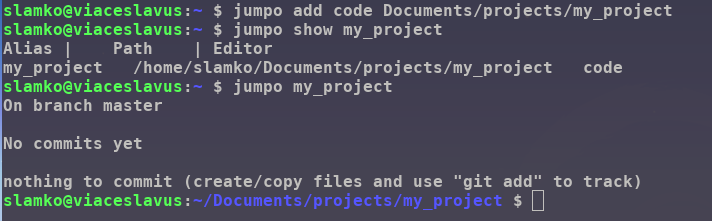
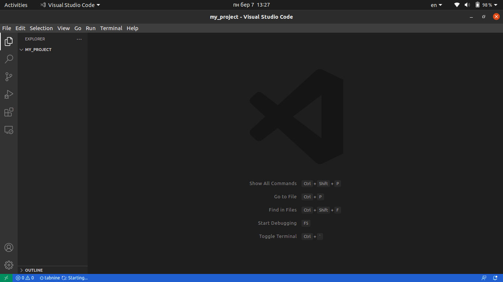

## Back to work with one shell command.
---
</br>

Add your project to jumpo list. 
Jump to your project directory with some git info and open an editor with one command.  

  


### Install:
```
sudo wget -O /usr/bin/jumpo https://raw.githubusercontent.com/Viaceslavus/jumpo/master/jumpo && 
sudo chmod +x /usr/bin/jumpo && 
echo "alias jumpo='source jumpo'" >> ~/.bash_aliases
```
* replace '.bash_aliases' with your preferred config file.
